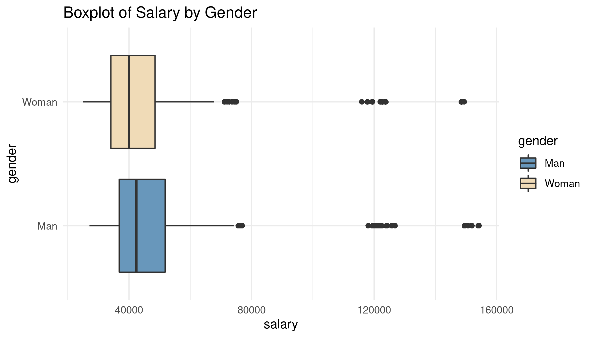
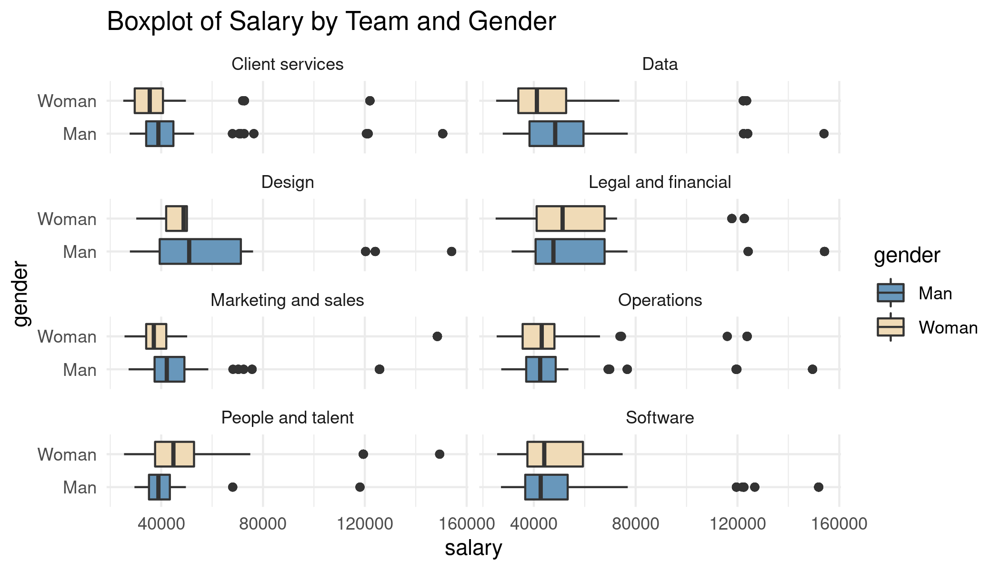

```{r, message = FALSE, echo=FALSE}
library(tidyverse)
# this should supress all code and messages
knitr::opts_chunk$set(include=FALSE)
```


\newpage
# Executive summary

_Guidelines for the executive summary:_

* _No more than two pages_
* _Language is appropriate for a non-technical audience_
* _Bullet points are used where appropriate_
*	_A small number of key visualizations and/or tables are included_
*	_All three research questions are addressed_


\newpage
# Technical report
_This part of the report is much more comprehensive than the executive summary. The audience is statistics/data-minded people, but you should NOT include code or unformatted R output here._


## Introduction
In the report, we analyzed hiring data for new grad program and data about promotion and salary for the entire staff in Black Saber Software, and investigated whether gender parity exists in Black Saber Software's hiring, promotion, and salary processes. This report helps the Board of Directors decide the fairness in hiring, promotion and wages.

The main contents of this report are as follows:

* Addressing the three research questions on gender parity in hiring, promotion, and salary processes.
* Summary of the findings across all three research questions.
* Strengths and limitations of our investigation.

### Research questions
* 
* 
* Whether gender pay inequality exists in Black Saber Software?

## Informative title for section addressing a research question
```{r}
# read in the data
black_saber_current_employees <- read_csv("data/black-saber-current-employees.csv")
```
```{r}
# transform salary data into numeric form and without special symbols
black_saber_current_employees$salary = as.numeric(gsub("[\\$,]", "", black_saber_current_employees$salary))
```

```{r}
# remove gender: prefer not to say
black_saber_current_employees_needed = filter(black_saber_current_employees, gender != "Prefer not to say")
```

```{r}
# number of employees who have indicated gender
count(unique(black_saber_current_employees_needed[c("employee_id")]))
```
```{r}
# number of employees who have not indicated gender
count(unique(filter(black_saber_current_employees, gender == "Prefer not to say")[c("employee_id")]))
```
```{r}
library(dplyr)
# Overall salary boxplot summary by gender
ggplot(black_saber_current_employees_needed, aes(x=gender, y=salary, fill=gender)) +
  geom_boxplot() + 
  theme_minimal() + 
  coord_flip() + 
  scale_fill_manual(values=c("#6897bb", "#f0dbb7")) + 
  ggsave("images/boxplot_s_gender.png", width = 7, height = 4)
```
```{r}
# Data Visualization
# Boxplot of salary of each team by gender
ggplot(black_saber_current_employees_needed, aes(x=gender, y=salary, fill=gender)) +
  geom_boxplot() + 
  facet_wrap(~team, nrow = 4) +
  theme_minimal() + 
  coord_flip() + 
  scale_fill_manual(values=c("#6897bb", "#f0dbb7")) + 
  ggsave("images/boxplot_s_team_gender.png", width = 7, height = 4)
```

```{r}
# transform role_seniority, gender, team, financial_q, leadership_for_level into factors
salary_data <- black_saber_current_employees_needed %>%
  mutate(role_seniority = as_factor(role_seniority)) %>%
  mutate(gender = as_factor(gender)) %>%
  mutate(team = as_factor(team)) %>%
  mutate(financial_q = as_factor(financial_q)) %>%
  mutate(leadership_for_level = as_factor(leadership_for_level)) %>%
  mutate(employee_id = as.character(employee_id))
```


We explored whether gender pay inequality exists in Black Saber Software by investigating the current employees dataset. This dataset includes data on all current employees for the whole duration of their employment, from 2013 Quarter 2 to 2020 Quarter 4. A total 6789 data from 597 employees who have indicated gender were included in this research question, but the 118 data from the 10 employees who have not indicated their gender were excluded. The source of the data is from Black Saber Software's data team. Each row represents salary, demonstrated leadership, and productivity for an employee in a given financial quarter. Productivity is rated on a 0-100 scale.

Salary data was first transformed into numeric form and special symbols like '$' and ',' were deleted from it. And then role_seniority, gender, team, financial_q, leadership_for_level were transformed into factors.

To have an overview of the salary distribution between men and women, we plotted the boxplot of salary by gender below. Since first quartile, median, third quartile, maximum of men's salary are all greater than women's salary, in general, men's salary in Black Saber Software is higher than women's salary.


Figure 1: Boxplot of Salary by Gender.


However, since salary differs from team to team, we further provided the boxplot of salary by team and gender. Among the 8 teams, women's salary is lower than men's salary in 4 teams in general, including Client services, Data, Design, Marketing and sales. In team People and talent, women's salary is greater than men's. And in Legal and finance, and Operations, women and men have similar salary distribution. Finally, in Software team, first quartile and median of salary are similar between men and women, but women's third quartile is higher, and men's maximum salary is higher.


Figure 2: Boxplot of Salary by Team and Gender.

Since salary may also be influenced by many other factors like role seniority, to further compare salary between men and women, we used a linear mixed model. The model for $Y_i$ ($i^{th}$ employee's salary) is as follows:

$Y_i$ = $\beta_0$ + $\beta_1$ $gender_i$ + $\beta_2$ $leadership\_for\_level_i$ + $\beta_3$ $productivity_i$ + $\beta_4$ $role\_seniority_i$ + $b_{1i}$ + $b_{2i}$ + $\epsilon_i$

Where $gender_i$ is the gender of the $i^{th}$ employee, $leadership\_for\_level_i$ is the the quality of demonstrated leadership for the $i^{th}$ employee, $productivity_i$ is the work output of the $i^{th}$ employee, $role\_seniority_i$ is the role seniority of the $i^{th}$ employee, $b_{1i}$ is the team-specific random effect, $b_{2i}$ is a employee-specific random effect, and $\epsilon_i$ denotes the residual error component.

The model included employee-specific random effect and team-specific random effect to address within-employee correlations and correlations among employees at the same team. Fixed effects in the model included gender, leadership for level, productivity, role seniority.

Since the p-value of the likelihood ratio test between model $Y_i$ = $\beta_0$ + $\beta_1$ $leadership\_for\_level_i$ + $\beta_2$ $productivity_i$ + $\beta_3$ $role\_seniority_i$ + $b_{1i}$ + $b_{2i}$ + $\epsilon_i$ (without fixed effect gender) and model $Y_i$ = $\beta_0$ + $\beta_1$ $gender_i$ + $\beta_2$ $leadership\_for\_level_i$ + $\beta_3$ $productivity_i$ + $\beta_4$ $role\_seniority_i$ + $b_{1i}$ + $b_{2i}$ + $\epsilon_i$ (without fixed effect gender) is 2.2e-16, we have very strong evidence against the hypothesis that the fixed effect gender is unnecessary complication to our model. Also the p-value for gender in the model is 2.13e-15, so we have very strong evidence against our null hypothesis that gender is not associated with change in salaries. While holding other predictors in the model constant, the average women salary is 2255.40 lower than the average men salary.

Based on data visualization, model selection and model interpretation, we concluded that there is gender pay inequality in Black Saber Software.

```{r}
library(tidyverse)
library(lme4)
# Model1: salary ~ leadership_for_level + productivity + role_seniority +   (1 | team)
# Fixed effects: leadership_for_level, productivity, role_seniority
# Random effect: team
model1 <- lmer(salary ~ leadership_for_level + productivity + role_seniority + (1|team), data = salary_data)
summary(model1)
```

```{r}
library(lme4)
# Model2: salary ~ leadership_for_level + productivity + role_seniority + (1|team) + (1|employee_id)
# Fixed effects: leadership_for_level, productivity, role_seniority
# Random effect: team, employee_id
model2 <- lmer(salary ~ leadership_for_level + productivity + role_seniority + (1|team) + (1|employee_id), data = salary_data)
summary(model2)
```
```{r}
# model 2 is better
lmtest::lrtest(model1, model2)
```

```{r}
# Model3: salary ~ gender + leadership_for_level + productivity + role_seniority + (1|team) + (1|employee_id)
# Fixed effects: gender, leadership_for_level, productivity, role_seniority
# Random effect: team, employee_id
model3 <- lmer(salary ~ gender + leadership_for_level + productivity + role_seniority + (1|team) + (1|employee_id), data = salary_data)
summary(model3)
```

```{r}
# model 3 would be the final model
lmtest::lrtest(model2, model3)
```
```{r}
# extended lmer model with p-value reported
library(lmerTest)
model3 <- lmer(salary ~ gender + leadership_for_level + productivity + role_seniority + (1|team) + (1|employee_id), data = salary_data)
summary(model3)
```

## Informative title for section addressing a research question
## Informative title for section addressing a research question


## Discussion

_In this section you will summarize your findings across all the research questions and discuss the strengths and limitations of your work. It doesn't have to be long, but keep in mind that often people will just skim the intro and the discussion of a document like this, so make sure it is useful as a semi-standalone section (doesn't have to be completely standalone like the executive summary)._

### Strengths and limitations

\newpage
# Consultant information
## Consultant profiles

*Complete this section with a brief bio for each member of your group. If you are completing the project individually, you only need to complete one for yourself. In that case, change the title of this section to 'Consultant profile' instead. Examples below. This section is only marked for completeness, clarity and professionalism, not 'truth' so you can write it as if we're a few years in the future. Put your current degree in as completed and/or add your first choice grad school program, whatever you like. What skills related skills would you most like to highlight? What job title do you want?*

**Statsy McStatsstats**. Statsy is a senior consultant with Eminence Analytics. She specializes in data visualization. Statsy earned her Bachelor of Science, Specialist in Statistics Methods and Practice, from the University of Toronto in 2023.

**Datana Scatterplot**. Datana is a junior consultant with Eminence Analytics. They specialize in reproducible analysis and statistical communication. Datana earned their Bachelor of Science, Majoring in Computer Science and Statistics from the University of Toronto in 2024.

**Xin Peng**. Xin is a senior consultant with Day Day Up Ltd. She specializes in data visualization. Xin earned her Bachelor of Science, Specialist in Computer Science and Data Science, from the University of Toronto in 2022.

## Code of ethical conduct

_This section should be fairly short, no more than half a page. Assume a general audience, much like your executive summary._

* _Make at least three relevant statements about your company’s approach to ethical statistical consulting. These should be appropriately in line with professional conduct advice like the (Statistical Society of Canada Code of Conduct)[https://ssc.ca/sites/default/files/data/Members/public/Accreditation/ethics_e.pdf] or the (Ethical Guidelines for Statistical Practice from the American Statistical Society)[https://www.amstat.org/ASA/Your-Career/Ethical-Guidelines-for-Statistical-Practice.aspx]. For example, "the customer is always right" ISN’T the type of thing an ethical statistical consultant would include._
*	_Be very careful not to just copy and paste from these other documents! Put things in your own words._